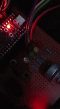

# Exercise-5
Exercise 5 – Demonstrate access contention problems when using shared resources in a multitasking system

## Deskripsi

Proyek ini menggunakan dua tugas sederhana yang berbagi satu sumber daya data. Tugas pertama menyalakan dan mematikan LED Hijau, sedangkan tugas kedua menyalakan dan mematikan LED Merah. Keduanya mengakses sumber daya bersama yang disimulasikan menggunakan delay perangkat lunak. Jika terjadi kontensi, LED Biru akan menyala sebagai indikator adanya masalah.

## Komponen yang Digunakan

- **Microcontroller**: STM32F103
- **LED**: Hijau, Merah, Biru
- **Flag Kontrol Akses**: Menggunakan flag biner (`Up` dan `Down`)

## Fitur Utama

- **Deteksi Kontensi Akses**: LED Biru akan menyala ketika kontensi akses terdeteksi.
- **Simulasi Operasi Baca/Tulis**: Menggunakan delay perangkat lunak untuk menyimulasikan akses sumber daya.
- **Prioritas Tugas**: Tugas LED Merah memiliki prioritas lebih tinggi dibandingkan tugas LED Hijau.

## Pengaturan

1. **Koneksi LED**:  
   - LED Hijau dihubungkan ke pin digital GPIO tertentu (misalnya `PA5`).
   - LED Merah dihubungkan ke pin digital GPIO tertentu (misalnya `PA6`).
   - LED Biru dihubungkan ke pin digital GPIO tertentu (misalnya `PA7`).

2. **Konfigurasi Prioritas Tugas**:  
   Atur prioritas tugas LED Merah lebih tinggi daripada tugas LED Hijau di dalam kode.

3. **Flag Akses**:  
   Inisialisasi flag akses dengan status `Up`.

## Cara Menggunakan

## Diagram System

## Uji Coba
 
